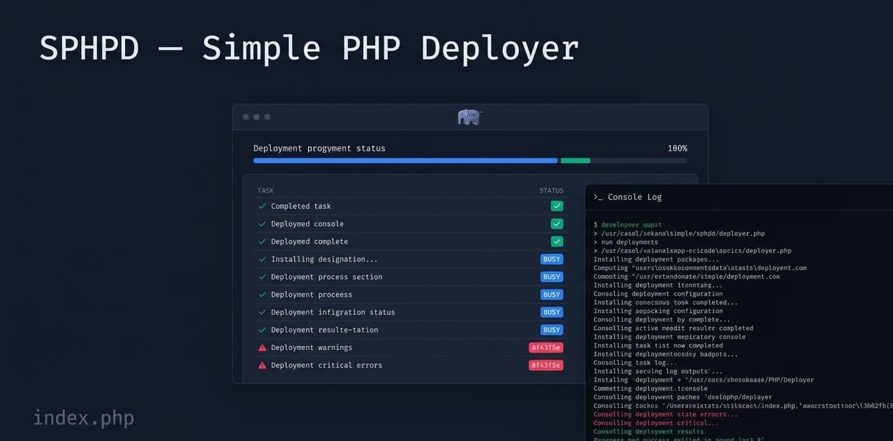

# SPHPD — Simple PHP Deployer

A minimalist, single-file PHP deployment tool with a live dashboard, webhook support, Telegram notifications, and JSON/YAML instruction files.

> **Requires PHP 8.5+**

---

## Features

- **Single file** — the entire application lives in `index.php`
- **JSON or YAML** instruction files
- **Live status dashboard** — real-time task progress with expandable output per task
- **Webhook endpoint** — trigger deployments via HTTP (with optional security token)
- **Artifact deploy** — download a GitLab CI artifact, extract it, and run instructions on it
- **Telegram notifications** — receive deployment results in a chat or thread
- **Multiple log formats** — plain text (`.log`), timestamped raw (`.rlog`), HTML (`.html`), and full raw stream (`.fraw`)
- **Logs browser** — paginated, tab-filtered view of all logs at `/alllogs`
- **Real-time `.fraw` log** — written line-by-line during execution; `tail -f` it for live stream debugging
- **HTTP Basic Auth** — optionally restrict access to the UI
- **Stop mid-run** — abort a running deployment from the dashboard
- **No-wait mode** — fire-and-forget webhook that returns `202 Accepted` immediately
- **Dark mode** UI built with Tailwind CSS

---

## Quick Start

### 1. Copy files to your server

Place `index.php` alongside your project or in a dedicated deployer directory.

### 2. Configure environment

```sh
cp .env.example .env
```

Edit `.env` with your settings (see [Configuration](#configuration)).

### 3. Create an instruction file

**`deploy.json`** (default):

```json
[
  { "name": "Git Pull", "run": "git pull origin main" },
  { "name": "Install Dependencies", "run": "composer install --no-dev" },
  { "name": "Optimize Cache", "run": "php artisan config:cache" }
]
```

Or use **`deploy.yml`** (requires `yq` — see [YAML Support](#yaml-support)):

```yaml
- name: "Git Pull"
  run: "git pull origin main"

- name: "Install Dependencies"
  run:
    - "composer install --no-dev"
    - "php artisan config:cache"
```

### 4. Start the built-in server (development)

```sh
composer start
# Runs php -S localhost:5173
```

Open `http://localhost:5173` to access the dashboard.

---

## Configuration

All configuration is done via `.env`:

| Variable                    | Default               | Description                                                          |
| --------------------------- | --------------------- | -------------------------------------------------------------------- |
| `PROJECT_PATH`              | _(required)_          | Absolute path where deployment commands run                          |
| `INSTRUCTIONS_FILE`         | `deploy.json`         | Path to your instruction file (JSON or YAML)                         |
| `LOGS_PATH`                 | `./logs`              | Directory where deployment logs are stored                           |
| `SECURITY_TOKEN`            |                       | Secret token required for webhook requests (header or query)         |
| `WEBHOOK_METHOD`            | `POST`                | HTTP method accepted by the webhook (`GET` or `POST`)                |
| `LOAD_USER`                 |                       | HTTP Basic Auth username (optional)                                  |
| `LOAD_PASS`                 |                       | HTTP Basic Auth password (optional)                                  |
| `TELEGRAM_NOTIFICATIONS`    | `true`                | Enable/disable Telegram notifications                                |
| `TELEGRAM_BOT_TOKEN`        |                       | Telegram bot token                                                   |
| `TELEGRAM_CHAT_ID`          |                       | Telegram chat or group ID                                            |
| `TELEGRAM_THREAD_ID`        |                       | Telegram thread/topic ID (optional, for supergroups)                 |
| `YQ_PATH`                   |                       | Path to the `yq` binary (required for YAML instruction files)        |
| `MODE`                      | `production`          | Set to any non-`production` value to enable the `/debugdeploy` route |
| `GITLAB_TOKEN`              |                       | GitLab private token to download CI artifacts                        |
| `GITLAB_BASE_URL`           | `https://gitlab.com`  | GitLab instance base URL (change for self-hosted)                    |
| `ARTIFACT_DEPLOY_DIR`       | `./artifact-deploy`   | Directory where artifacts are downloaded and extracted               |
| `ARTIFACT_INSTRUCTIONS_FILE`| `artifact-deploy.json`| Instruction file executed after artifact extraction                  |

---

## Instruction File Format

Each instruction file is an **array of tasks**. A task has:

| Field  | Type            | Description                          |
| ------ | --------------- | ------------------------------------ |
| `name` | string          | Human-readable label shown in the UI |
| `run`  | string or array | Shell command(s) to execute in order |

Commands within a task share the same shell session, so environment variables exported in one command are available in subsequent ones.

### Examples

**Single command:**

```json
{ "name": "Pull latest code", "run": "git pull origin main" }
```

**Multiple commands (array):**

```json
{
  "name": "Build",
  "run": ["export NODE_ENV=production", "npm ci", "npm run build"]
}
```

**Multi-line script (YAML block scalar):**

```yaml
- name: "Deploy"
  run: |
    git pull origin main
    composer install --no-dev
    php artisan migrate --force
```

---

## Endpoints

### Standard Deploy

| Method     | Path                       | Description                                                     |
| ---------- | -------------------------- | --------------------------------------------------------------- |
| `GET`      | `/`                        | Redirects to `/health`                                          |
| `GET`      | `/health`                  | Main dashboard — history, config status, example                |
| `GET/POST` | `/webhook/deploy`          | Trigger deployment (waits for completion)                       |
| `GET/POST` | `/webhook/deploy?manual=1` | Trigger deployment from the UI (background process)             |
| `POST`     | `/webhook/deploy/nowait`   | Trigger deployment — returns `202` immediately                  |
| `GET`      | `/status/live`             | Real-time live status page                                      |
| `GET`      | `/status/check`            | JSON: `{ "finished": true/false }`                              |
| `GET`      | `/status/data`             | JSON: full current deployment status                            |
| `GET`      | `/alllogs`                 | Browse all logs with tab filter (`?type=log\|rlog\|html\|fraw`) |
| `GET`      | `/log/view?file=<name>`    | View a specific log file                                        |
| `GET`      | `/log/rview/<id>`          | Formatted `.log` view by ID                                     |
| `GET`      | `/log/bview/<id>`          | Timestamped `.log.rlog` view by ID                              |
| `GET`      | `/log/htmlview/<id>`       | HTML `.log.html` view by ID                                     |
| `GET`      | `/log/frawview/<id>`       | Full raw stream `.log.fraw` view by ID                          |
| `GET`      | `/log/last`                | Most recent formatted log                                       |
| `GET`      | `/log/lasthtml`            | Most recent HTML log                                            |
| `GET`      | `/log/lastfraw`            | Most recent full raw stream log                                 |
| `POST`     | `/deploy/stop`             | Stop the currently running deployment                           |
| `GET`      | `/test-notify`             | Send a test Telegram notification                               |
| `GET`      | `/clear-history`           | Clear all deployment log history                                |

### Artifact Deploy

| Method | Path                              | Description                                              |
| ------ | --------------------------------- | -------------------------------------------------------- |
| `POST` | `/webhook/artifact-deploy`        | Download artifact, extract, and run instructions (sync)  |
| `POST` | `/webhook/artifact-deploy/nowait` | Same as above but returns `202 Accepted` immediately     |

### Webhook Security

When `SECURITY_TOKEN` is set, all webhook requests must include it:

- **Header:** `X-Deploy-Token: <token>`
- **Query string:** `?token=<token>`

Requests from `localhost` / `127.0.0.1` are always allowed (for UI-triggered deployments).

---

## Artifact Deploy

This feature lets a GitLab CI pipeline notify the deployer, which then downloads the pipeline artifact, extracts it, and runs a set of instructions — all without requiring the server to have Git access.

### How it works

```
GitLab CI pipeline
       │
       │  POST /webhook/artifact-deploy
       │  { "project_id": "123", "branch": "main", "job": "build" }
       ▼
SPHPD (index.php)
   1. Validates X-Deploy-Token
   2. Downloads artifact ZIP from GitLab API using GITLAB_TOKEN
   3. Extracts to artifact-deploy/extracted/
   4. Runs tasks from artifact-deploy.json (CWD = extracted dir)
   5. Sends Telegram notification with result
```

### Setup

**1. Add environment variables:**

```env
GITLAB_TOKEN=your_gitlab_private_token
# Optional (defaults shown):
GITLAB_BASE_URL=https://gitlab.com
ARTIFACT_DEPLOY_DIR=./artifact-deploy
ARTIFACT_INSTRUCTIONS_FILE=artifact-deploy.json
```

**2. Create `artifact-deploy.json`:**

```json
[
  {
    "name": "Show extracted files",
    "run": "ls -la"
  },
  {
    "name": "Copy to web root",
    "run": "rsync -av --delete dist/ /var/www/html/"
  },
  {
    "name": "Reload service",
    "run": "systemctl reload nginx"
  }
]
```

The working directory for all commands is the **extracted artifact directory**, so paths are relative to the artifact contents.

**3. Call from your GitLab CI pipeline (`.gitlab-ci.yml`):**

```yaml
notify-deploy:
  stage: deploy
  script:
    - |
      curl -X POST https://your-server/webhook/artifact-deploy \
        -H "X-Deploy-Token: $SECURITY_TOKEN" \
        -H "Content-Type: application/json" \
        -d '{
          "project_id": "'$CI_PROJECT_ID'",
          "branch":     "'$CI_COMMIT_REF_NAME'",
          "job":        "build"
        }'
  only:
    - main
```

Or use `/webhook/artifact-deploy/nowait` if you don't want the pipeline to wait for the deployment to finish:

```yaml
    - |
      curl -X POST https://your-server/webhook/artifact-deploy/nowait \
        -H "X-Deploy-Token: $SECURITY_TOKEN" \
        -H "Content-Type: application/json" \
        -d '{"project_id":"'$CI_PROJECT_ID'","branch":"'$CI_COMMIT_REF_NAME'","job":"build"}'
```

### Request body

| Field        | Type   | Default  | Description                                     |
| ------------ | ------ | -------- | ----------------------------------------------- |
| `project_id` | string | required | GitLab project ID (available as `$CI_PROJECT_ID`) |
| `branch`     | string | `main`   | Branch name to fetch the artifact from           |
| `job`        | string | `build`  | CI job name that produced the artifact           |

### Artifact format support

| Format | Method                                        |
| ------ | --------------------------------------------- |
| `.zip` | PHP `ZipArchive` (built-in, no dependencies)  |
| `.rar` | `unrar` command, falls back to `7z`           |
| other  | `7z` (universal fallback — tar, gz, xz, etc.) |

> GitLab artifacts are always ZIP files. RAR and `7z` fallback support is available for custom artifact sources.

### Logs

Artifact deployments produce the same four log files as standard deployments, using the prefix `artifact_deploy_YYYYMMDD_HHmmss` instead of `deploy_`. They are visible in the `/alllogs` browser.

---

## Log Formats

Each deployment produces four log files in `LOGS_PATH`, all sharing the same base name (`deploy_YYYYMMDD_HHmmss` or `artifact_deploy_YYYYMMDD_HHmmss`):

| Extension   | Format     | Written      | Description                                                                                                                        |
| ----------- | ---------- | ------------ | ---------------------------------------------------------------------------------------------------------------------------------- |
| `.log`      | Plain text | After finish | Human-readable summary with task separators and exit codes                                                                         |
| `.log.rlog` | Plain text | After finish | Timestamped entries prefixed with `[info  ]` / `[error ]`                                                                          |
| `.log.html` | HTML       | After finish | Styled log with color-coded stderr, viewable in a browser                                                                          |
| `.log.fraw` | Plain text | **Per line** | Full raw stream — every line prefixed `[STDOUT]` / `[STDERR]`, including internal EOF signals (`__STDOUT_EOF__`, `__STDERR_EOF__`) |

The `.fraw` file is written incrementally as output is received, making it suitable for real-time monitoring:

```sh
tail -f logs/deploy_20240101_120000.log.fraw
```

---

## YAML Support

To use a `.yml` / `.yaml` instruction file, you need the [`yq`](https://github.com/mikefarah/yq) binary:

1. Download the appropriate binary for your platform (a `yq_linux_amd64` binary is included in this repository for convenience).
2. Set `YQ_PATH` in your `.env`:

```env
INSTRUCTIONS_FILE=deploy.yml
YQ_PATH=./yq_linux_amd64
```

The deployer will automatically make the binary executable if needed.

---

## Telegram Notifications

Configure a bot to receive deployment reports:

```env
TELEGRAM_NOTIFICATIONS=true
TELEGRAM_BOT_TOKEN=123456:ABC-your-bot-token
TELEGRAM_CHAT_ID=-1001234567890
TELEGRAM_THREAD_ID=42          # optional, for forum/topic groups
```

Notifications are sent on deployment completion (success or failure), including for artifact deployments. Use `/test-notify` to verify your setup.

---

## Development

### Linting / Formatting

This project uses [Mago](https://github.com/carthage-software/mago) for PHP code style:

```sh
composer mago
# or
vendor/bin/mago
```

Configuration is in `mago.toml`.

---

## Project Structure

```
index.php               # Entire application (router, logic, UI)
deploy.json             # Default instruction file for standard deploys
deploy.yml              # Alternative instruction file (YAML example)
artifact-deploy.json    # Default instruction file for artifact deploys
.env.example            # Environment variable template
.env                    # Your local configuration (not committed)
logs/                   # Deployment logs (auto-created)
artifact-deploy/        # Artifact download & extraction directory (auto-created)
mago.toml               # Mago code style configuration
composer.json           # Dev dependencies (mago)
yq_linux_amd64          # yq binary for YAML support (Linux x86_64)
```
